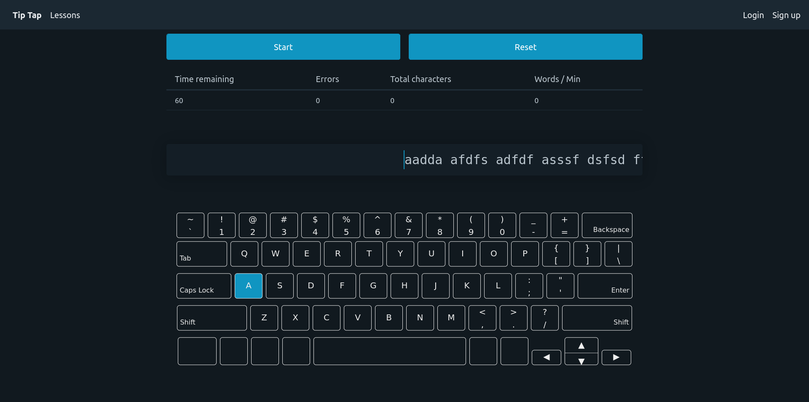

# TipTap

*Tippity tap tap tap* 

That's the sound of your keyboard when you're in the zone, typing your life away!




## Prequisites

In order to use this application you must first install [Node.js](https://www.nodejs.org). Follow the instructions provided by Node.js to complete the installation.

Next, install [Git](http://www.git-scm.com). 

## Getting Started

Open a terminal (or command prompt) on your machine and run the following commands:

```
git clone https://github.com/danielsprohar/tip-tap.git
cd tip-tap/server
npm install
npm run start
```

Open another terminal to the root directory of this repository

```
cd web-app
npm install
npm run start
```

Now navigate to http://localhost:4200 to start typing.
