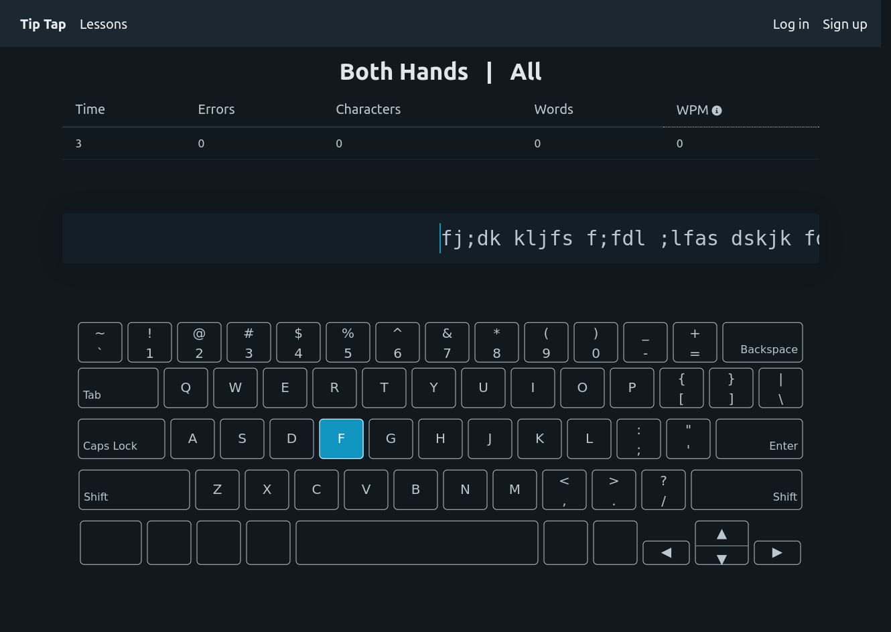
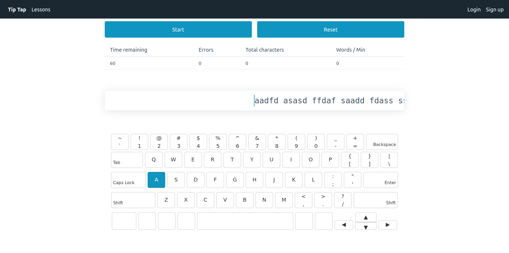

# TipTap

_Tippity tap tap tap_

That's the sound of your keyboard when you're in the zone, typing your life away!





## Getting Started

Open a terminal (or command prompt) on your machine and run the following commands:

```
git clone https://github.com/danielsprohar/tip-tap.git
cd tip-tap
npm install
npm run start
```

Now navigate to http://localhost:4200 to start typing.
